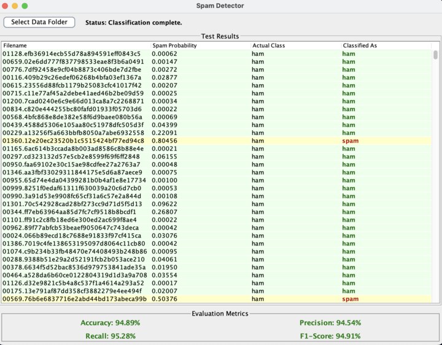

**Intro :**

This project is about a java based spam detection program that utilizes a probability-based algorithm to classify email as potential spam. It allows users to upload a set of emails (spam and ham), train a classification model and then evaluate the overall performance of the program with its accuracy, precision etc. The application includes a GUI built with Java Swing for selecting datasets, displaying classification results, and viewing evaluation metrics.

**
Improvements: **

1. Improved Tokenization
Issue:
  	The original tokenization process included punctuation and non-word characters, which increased noise.
Solution:
  Implemented a refined tokenization method using regular expressions to extract only valid words. This     	approach filters out punctuation and irrelevant symbols, reducing noise and improving classification accuracy.
2. Laplace Smoothing for Probability Calculation
Issue:
   Unseen words in the test data were assigned a probability of 0.0, leading to instability and skewed results.
Solution:
Applied Laplace smoothing by adding +1 to the numerator and +2 to the denominator during probability  calculations. This prevents any word from obtaining an extreme probability of exactly 0 or 1, resulting in more stable and reliable predictions.
3. Threshold Adjustment
Change:
   	Adjusted the decision threshold for classifying an email as spam to 0.7.
Rationale:
 	 This conservative threshold reduces the risk of misclassifying ham emails as spam. It favors a scenario where spam emails might occasionally be missed (false negatives) rather than incorrectly marking ham emails as spam (false positives).
4. UI Enhancements with Color-Coded Results
Color-Coded Feedback:
Light Red: Emails correctly classified as spam are highlighted with a light red background.
Light Green: Emails correctly classified as ham are highlighted with a light green background.
Yellow: Misclassified emails are highlighted with a yellow background.
Additional Customization:
  The "Classified As" column features bold text with dark red for spam and dark green for ham, enhancing the visual distinction of classification results.
5. Column Sorting in the GUI
New Feature:
   The GUI now supports sorting of results based on any column.
How It Works:
Users can click on the header of any column to sort the results. A small arrow is displayed on the column header to indicate the current sort order (ascending or descending), allowing for easy and intuitive data organization.

6. Evaluation Metrics
New Metrics Added:
  Incorporated evaluation metrics such as Recall and F1-Score to provide a more comprehensive assessment of the classifier's performance alongside precision.
Benefit:
  These metrics help in understanding the balance between false positives and false negatives, enabling better tuning of the classifier.
7. Asynchronous Processing with SwingWorker
Issue Addressed:
  Long-running tasks (such as file processing and classification) were causing the UI to freeze.
Solution:
   Utilized the SwingWorker class to perform these tasks in the background, ensuring that the UI remains responsive during processing.

**How to run:**

Ensure Java is installed 
Git installed for cloning repos
Clone the repository by doing git clone “repo link”
Change directory into src/main
Compile the java file: javac -d bin -sourcepath src src/main/SpamDetectorGUI.java
Run the application: java -cp bin SpamDetectorGUI
Select a folder containing the dataset structure
- train/spam
- train/ham
- test/spam
- test/ham

**Screenshot:**

Here is a sample output after running:
div align="center">
  

