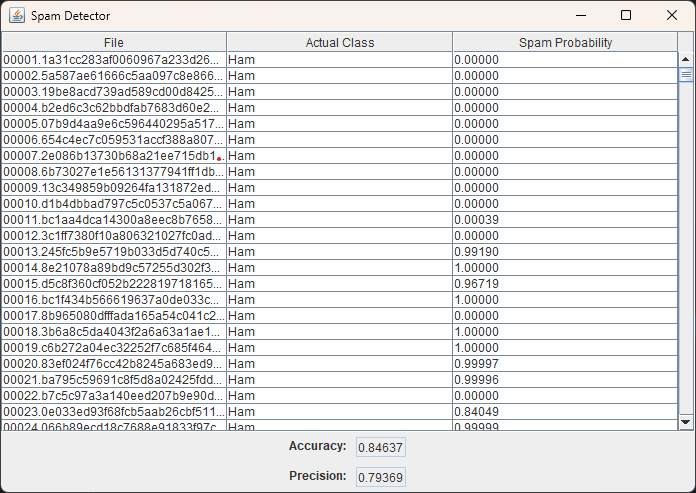

# Assignment 1 - Spam Detection
CSCI 2020U: System Development and Integration

## Overview
You have become frustrated with all the advertisements in your inbox. You resolve to create a spam detector to filter out the spam. The spam detector will use a dataset of E-Mails (spam or otherwise) to train your program to recognize whether or not new E-Mails are spam. The program will use a unigram approach [1], where each word is counted and associated with whether or not the message is spam. Your program will calculate probabilities based on each word’s frequency [2]. Luckily, you have not emptied your spam folder or inbox in quite a while, so you have many samples to train your system.

### Primary Instructions
Before you begin, download the training and testing data containing spam (unwanted messages, often advertisements) and ham (wanted emails, not spam) messages. The data is divided into two folders: train and test.
The train folder will be used to determine word frequencies, and the test folder will be used to evaluate your spam filter. Within these two folders, the spam messages are in a spam folder, and the ham messages are in a ham folder.

#### Training
In the training phase, the program will read all the files (each containing one E-Mail) in both the training/spam and training/ham folders. You will determine which words exist in each file. A good starting point for this code is the File I/O sample we completed in the lectures. For simplicity, let’s ignore the case, and let’s also ignore how many times a word appears in a single file and count how many files have the word.
We’ll combine these words into two frequency maps: `trainHamFreq` and `trainSpamFreq`. The map `trainHamFreq` contains a map of words and the number of files containing that word in the ham folder. The map `trainSpamFreq` contains a map of words and the number of files containing that word in the spam folder.
This part of the process aims to collect a set of $Pr(S|W_i)$ values for each word $W_i$. $Pr(S|W_i)$ is the probability that a file is spam because it contains the word $W_i$. $Pr(W_i|S)$ is the probability that the word $W_i$ appears in a spam file. $Pr(W_i|H)$ is the probability that the word $W_i$ appears in a ham file.

```math
Pr\left(S|W_i\right) = \frac{Pr\left(W_i|S\right)}{Pr\left(W_i|S\right) + Pr\left(W_i|H\right)}
```
<br>

```math
Pr\left(W_i|S\right) = \frac{ \text{\# of spam files containing }W_i }{ \text{\# of spam files} }
```
<br>

```math
Pr\left(W_i|H\right) = \frac{ \text{\# of ham files containing }W_i }{ \text{\# of ham files} }
```
<br>

>Note: It is recommended that you put all of these probabilities, $Pr(S|W_i)$, into a map (e.g. TreeMap) indexed by the word, $W_i$, itself. Using a map for this purpose is efficient and will result in shorter code since you will not need to search through a list of probabilities.

#### Testing
Once we have built our probability map, we’ll examine two more folders: test/ham and test/spam. The emails in test/ham are not spam, and those in test/spam are spam. Do not use these files to train your program. We are now going to see how well your spam detector works.
Each file in both directories will be examined, word by word. The ham and spam probabilities for each word in a file will be used to compute the probability that the file is spam.

```math
\eta = \sum_{i=1}^{N} \Big[ \ln \big( 1 - Pr\left(S|W_i\right) \big) - \ln \big( Pr\left(S|W_i\right) \big) \Big]
```
<br>

```math
Pr\left(S|F\right) = \frac{1}{1 + e^\eta}
```
<br>

>Note: The reason for the logarithms and exponents is complicated. The short story is that if we multiply probabilities, we may have values too small to represent with floating points for large files accurately. Taking the logarithm normalizes the numbers.
The probability that a file is spam, $Pr(S|F)$, is determined by the formulae above. Some useful Mathematical operations and constants are given in the following table:

| Function or Constant | Description                                    |
|----------------------|------------------------------------------------|
| Math.E               | The constant `e`                               |
| Math.log(x)          | Calculates the natural logarithm of x: $ln(x)$ |
| Math.pow(x,y)        | Calculate $x$ to the exponent $y$: $x^y$       |

This step will result in a `List` of `TestFile` objects. The `TestFile` class is given.

##### Evaluation
When your application starts, it will ask the user to choose a directory. Below is an example of this code for Java Swing. The user will select the folder containing the train and test folders. Your application will then run the training and testing phases described above.

```java
JFileChooser directoryChooser = new JFileChooser();
directoryChooser.setFileSelectionMode(JFileChooser.DIRECTORIES_ONLY);
directoryChooser.setCurrentDirectory(new File("."));

int returnValue = directoryChooser.showOpenDialog(window);
...
File mainDirectory = directoryChooser.getSelectedFile();
```

Once training and testing has completed, display your results in a `JTable`, including columns for the filename (which is unique), your spam detector’s categorization, and the actual category (which is already known, based on the folder name). At the bottom of your application window, display some summary stats, including the percentage of correct guesses (accuracy) and the ratio of correct positives (spam) to spam guesses (correct or not) (precision). An example of the output is given in the figure.

```math
\text{accuracy} = \frac{ \text{numCorrectGuesses} }{ \text{numGuesses} } = \frac{ \text{numTruePositives} + \text{numTrueNegaives} }{ \text{numFiles} }
```
<br>

```math
\text{precision} = \frac{ \text{numTruePositives} }{ \text{numFalsePositives} + \text{numTruePositives} }
```

<div align="center">
  
</div>

### Secondary Instructions
- **The interface.** While the figure shows the most basic version of your UI for the spam detector, you are expected to improve the screen's aesthetics.
- **The model.** Can you think of any way to improve the spam detector? Research and see how much you can improve your score in your final product. Start with a copy of your bag of words, Bayesian spam detector, above, and modify it to implement your ideas and verify that they work.
- **The data.** The training and testing data are given to you on the boilerplate template for the assignment `spamDetectorServer/src/main/resources/`. You will note that in the training data, the ham files are split into 2 folders, that’s to reduce the training time; however, you are encouraged to use the data in both folders for your training after you have completed the algorithm in the SpamDetector class.
- **README.md** Make sure your project includes a readme.md file containing the following sections:
  - Project information: a short textual description of your project and at least one screenshot of your application running.
  - Improvements: briefly describe your improvements to the interface and/or the model (if any).
  - How to run: Here is the step-by-step information on successfully cloning and running your application.
  - Screenshot/recording: a screenshot/recording demonstrating the application running
  - Other resources: any references to other materials/libraries that you might have used on your solution or model improvement.

>- Feel free to create other helper classes as you see fit.
>
>- You are not expected to get the exact same values as the ones shown in the samples.

### References
[1] https://en.wikipedia.org/wiki/Bag-of-words_model

[2] https://en.wikipedia.org/wiki/Naive_Bayes_spam_filtering