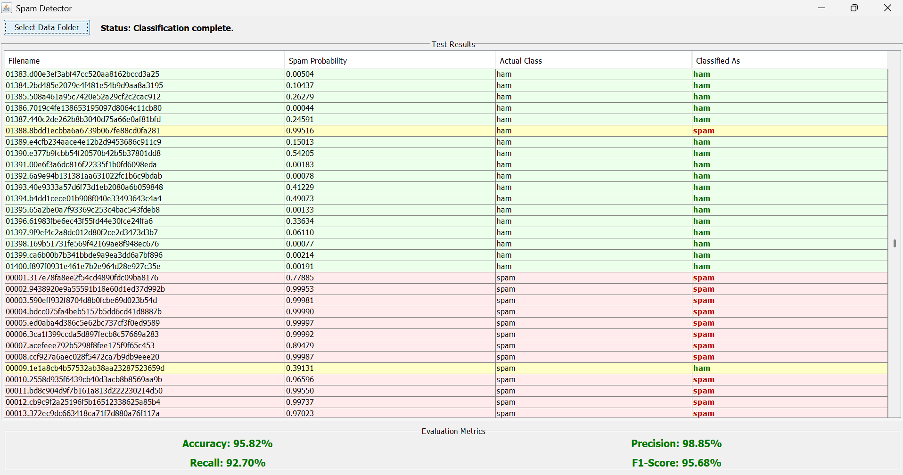

# Spam Detector Program

## Introduction

This project is a Java-based spam detection program that utilizes a probability-based algorithm to classify emails as potential spam. The application allows users to upload datasets (both spam and ham emails), train a classification model, and evaluate the overall performance using metrics such as accuracy, precision, recall, and F1-Score. The GUI, built with Java Swing, provides an intuitive interface for selecting datasets, viewing classification results, and checking evaluation metrics.

## Improvements and Enhancements

### 1. Improved Tokenization
The original tokenization process included punctuation and non-word characters which increased noise. A refined tokenization method was implemented using regular expressions to extract only valid words. This approach filters out punctuation and irrelevant symbols to reduce noise and improve classification accuracy.

### 2. Laplace Smoothing for Probability Calculation
Unseen words in the test data were assigned a probability of 0.0 which lead to instability and skewed results. Laplace smoothing was applied by adding +1 to the numerator and +2 to the denominator during probability calculations. This prevents any word from obtaining an extreme probability of exactly 0 or 1 to achieve more stable and reliable predictions.

### 3. Threshold Adjustment
The decision threshold for classifying an email as spam has been adjusted to **0.7**. This conservative threshold reduces the risk of misclassifying ham emails as spam. It favors a scenario where spam emails might occasionally be missed (false negatives) rather than incorrectly marking ham emails as spam (false positives).

### 4. UI Enhancements with Color-Coded Results
- **Color-Coded Feedback:**
  - **Light Red:** Emails correctly classified as spam are highlighted with a light red background.
  - **Light Green:** Emails correctly classified as ham are highlighted with a light green background.
  - **Yellow:** Misclassified emails are highlighted with a yellow background.
- **Additional Customization:** The "Classified As" column features bold text with dark red for spam and dark green for ham to enhance the visual distinction of classification results.

### 5. Column Sorting in the GUI
The GUI now supports sorting of results based on any column. Users can click on the header of any column to sort the results. A small arrow is displayed on the column header to indicate the current sort order (ascending or descending) for easy and intuitive data organization.

### 6. Evaluation Metrics
Evaluation metrics such as **Recall** and **F1-Score** have been incorporated to provide a more comprehensive assessment of the classifier's performance alongside precision. These metrics help in understanding the balance between false positives and false negatives to enable better tuning of the classifier.

### 7. Asynchronous Processing with SwingWorker
Long-running tasks (such as file processing and classification) were causing the UI to freeze. The `SwingWorker` class is utilized to perform these tasks in the background to ensure that the UI remains responsive during processing.

### 8. Enhanced GUI Layout and Visual Appeal
The GUI layout has been redesigned to be more intuitive and visually appealing. Enhanced spacing, alignment, and styling contribute to a more user-friendly experience.

## How to Run

1. **Prerequisites:**
   - Ensure Java is installed on your system.
   - Ensure Git is installed for cloning the repository.


2. **Clone the Repository:**

   - `git clone <repo_link>`


3. **Change Directory:**
   
   - `cd <repository_name>/src/main`


4. **Compile the Application:**
  
   - `javac -d ../bin -sourcepath . SpamDetectorGUI.java`


5. **Run the Application:**
   
   - `java -cp ../bin SpamDetectorGUI`


6. **Dataset Structure:** 
When prompted, select a folder that contains the following structure:
```
train/
   spam/
   ham/
test/
   spam/
   ham/
```

## Screenshot:

